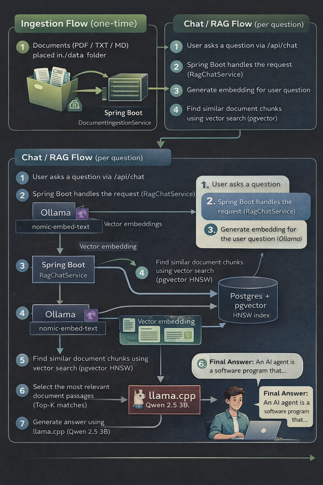
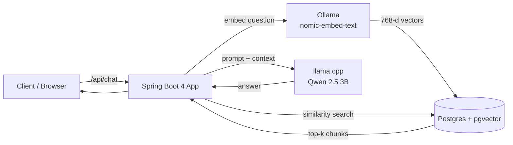
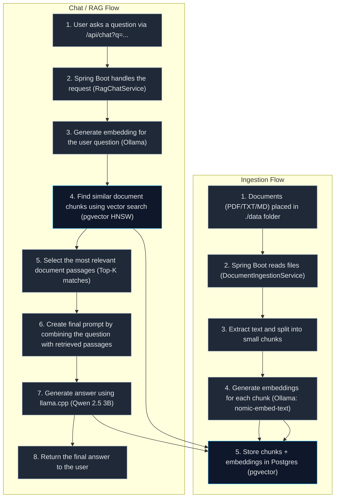

# 🧠 Local RAG System (llama.cpp + Ollama + pgvector)


A fully local Retrieval-Augmented Generation (RAG) system that lets you chat 
with PDFs and documents using open-source models — no cloud APIs, no keys, 
no data leaving your machine.

🦙 What is llama.cpp

Imagine this first, You have a big AI brain (like ChatGPT), but it’s usually kept in a huge data center.
llama.cpp is a tool that lets you:
- take that AI brain
- shrink it down
- run it on your own computer
- without the internet

🧠 In simple words
llama.cpp is a super-efficient engine that runs AI language models locally on your
laptop or server.

- No cloud.
- No account.
- No API key.
- No tracking.

🔍 What llama.cpp actually does
- Loads LLM models (LLaMA, Mistral, Qwen, Gemma, etc.)
- Runs them using your CPU or GPU
- Uses clever math tricks so big models fit on normal machines
- Exposes every low-level knob (memory, threads, GPU layers, quantization)

Think of it as:
“The Linux kernel of local LLMs”



## 🏗️ High-Level Architecture



### Data Flow



## 🧩 Components Explained

### 🟢 Spring Boot Application

The brain of the system

Responsibilities:
- Ingest documents (PDF / TXT / MD)
- Chunk and store them
- Handle chat queries
- Orchestrate RAG flow

Key modules:
- DocumentIngestionService
- RagChatService
- ChatClient (Spring AI)
- Optional caching (Caffeine)

### 🟣 Ollama (Embeddings Only)

Semantic understanding layer
- Model: nomic-embed-text
- Output: 768-dimension vectors
- Why:
  - Fast on CPU
  - High-quality retrieval
  - Compatible with pgvector HNSW index

Used for:
- Document ingestion
- User question embedding

### 🔵 PostgreSQL + pgvector

Vector database

Stores:
- Document chunks
- Metadata (source, page, filename)
- Embeddings

Features:
- HNSW index for fast similarity search
- Persistent storage via Docker volume

### 🔴 llama.cpp (Chat / Generation)

Answer generation engine
- Model: Qwen 2.5 3B Instruct (GGUF)
- Runs fully locally on CPU
- Exposes OpenAI-compatible API

Used for:
- Generating the final answer
- Taking RAG context + question

## 🔁 Request Flow (End-to-End)

### 1️⃣ Ingestion (POST /api/ingest)

```jsunicoderegexp
PDF/TXT → extract text
        → chunk content
        → embed chunks (Ollama)
        → store in pgvector
```


### 2️⃣ Chat (GET /api/chat?q=...)

```jsunicoderegexp
User question
 → embed question (Ollama)
 → similarity search (pgvector)
 → top-k chunks retrieved
 → context injected into prompt
 → llama.cpp generates answer
 → response returned
```

## ▶️ How to Run

Prerequisites
- Docker + Docker Compose
- Java 25
- Gradle
- ~8GB RAM recommended

⸻

### 1️⃣ Clone the repository

```bash
git clone https://github.com/ksktechai/llamacpp-rag.git
cd llamacpp-rag
```

### 2️⃣ Download the chat model (once)

```bash
mkdir -p models

curl -L -o models/qwen2.5-3b-instruct-q4_k_m.gguf \
https://huggingface.co/Qwen/Qwen2.5-3B-Instruct-GGUF/resolve/main/qwen2.5-3b-instruct-q4_k_m.gguf
```

### 3️⃣ Start infrastructure

```bash
docker compose up -d
```

This starts:
- PostgreSQL + pgvector
- Ollama
- llama.cpp

Pull embedding model:
```jsunicoderegexp
docker exec -it ollama ollama pull nomic-embed-text
```

### 4️⃣ Start the Spring Boot app

```bash
./gradlew bootRun
```

### 5️⃣ Ingest documents

Place files in ./data (PDF / TXT / MD), then:

```bash
curl -X POST http://localhost:8080/api/ingest
```

### 6️⃣ Chat with your documents

```bash
curl -G "http://localhost:8080/api/chat" \
  --data-urlencode "q=What is an AI agent according to the guide?"
  
{"question":"What is an AI agent according to the guide?","answer":"An AI agent according to the guide is a cognitive system that can automate complex workflows, create novel user experiences, and solve business problems that were previously technically infeasible. The guide provides a roadmap to navigate the new landscape of agentic systems, covering foundational concepts, principles for reliable and responsible operation in production, and a full spectrum of tools for building and using agents on Google Cloud."}
```

---

## 📬 API Testing (Postman)

This repository includes a ready-to-use **Postman collection** for testing the RAG APIs.

📁 **Location:**

docs/llama-cpp.postman_collection.json

### What’s included
```jsunicoderegexp
- Document ingestion (`/api/ingest`)
- Example RAG queries against the ingested PDF
- Real-world questions based on the *Startup Technical Guide – AI Agents*
```
### How to use
```jsunicoderegexp
1. Open Postman
2. Click **Import**
3. Import the file:

4. Ensure the Spring Boot app is running on `http://localhost:8080`
5. Run the requests in order (ingest → chat queries)
```

📖 Detailed usage instructions are available here: ➡️ **[Postman Collection README](docs/README-postman.md)**
